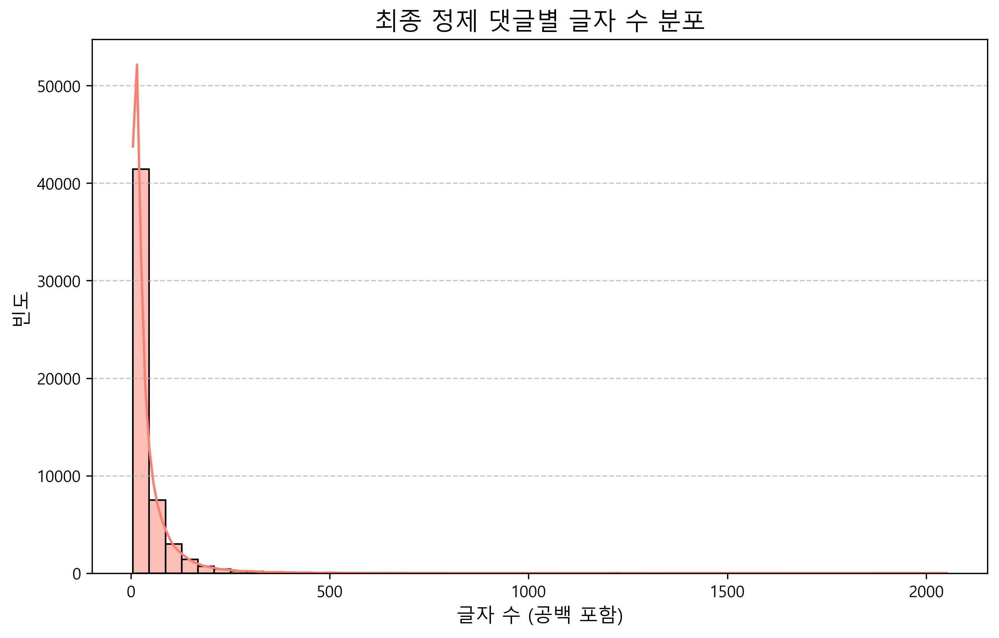
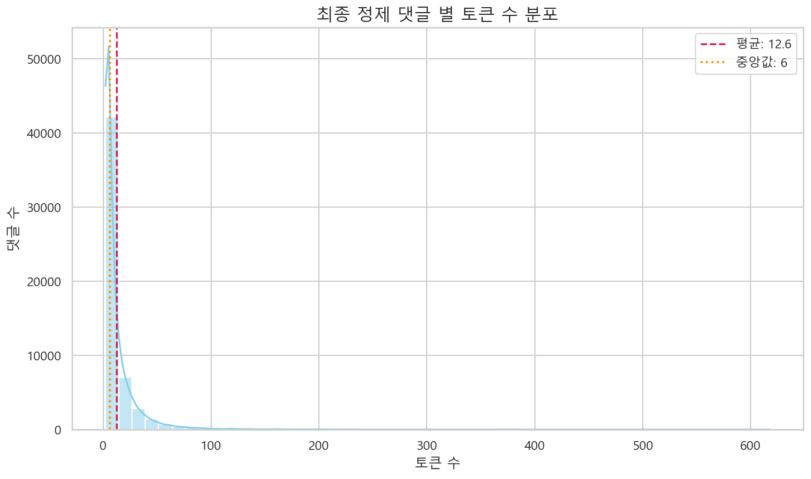
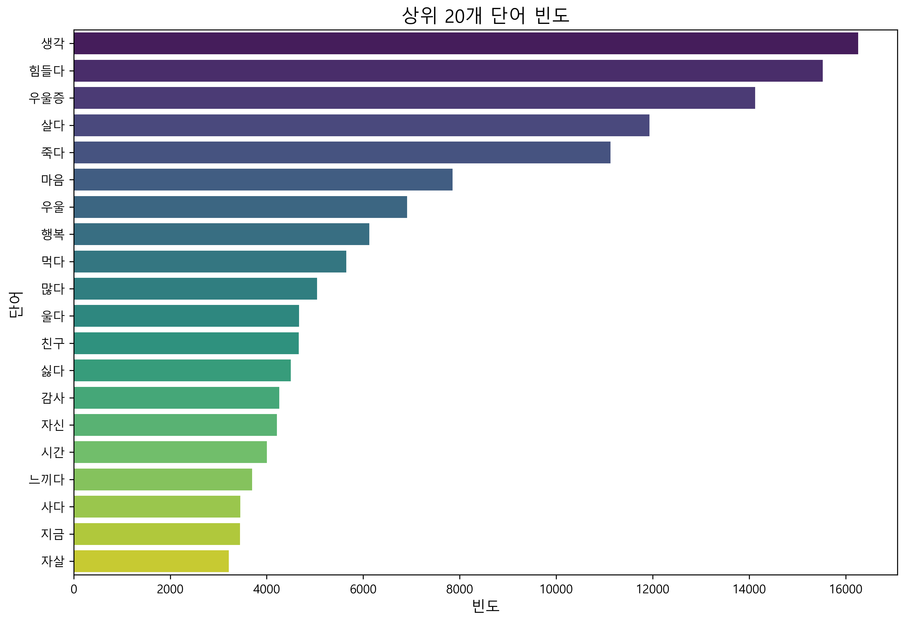
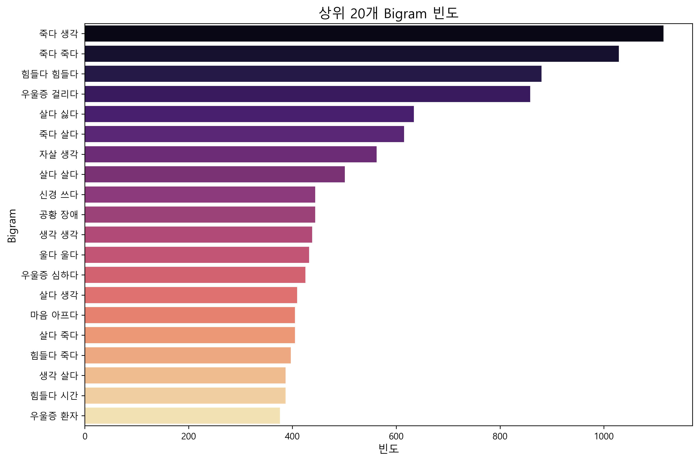

# 유튜브 댓글 분석 프로세스 가이드

이 문서는 유튜브 댓글 데이터를 활용한 텍스트 마이닝 연구의 전체 과정을 상세히 기록하고 있습니다. 데이터 수집부터 최종 분석용 데이터셋 생성까지의 파이프라인을 포함합니다.

---

## 1. 프로젝트 구조 및 파일 설명

프로젝트는 GitHub 표준 데이터 사이언스 구조를 따르며, 각 폴더의 역할은 다음과 같습니다.

### 📂 `notebooks/` (분석 단계별 실행 파일)
*   **`Youtube_crawl.ipynb`**: 데이터 수집용 노트북. 외부 라이브러리를 활용하여 유튜브 댓글을 크롤링합니다.
*   **`preprocess.ipynb`**: 기초 데이터 정제용 노트북. 수집된 로우 데이터를 통합하고 노이즈를 제거합니다.
*   **`adaptive_preprocess.ipynb`**: **[핵심]** 적응적 전처리 노트북. 형태소 분석 후 불용어 제거, 저빈도 단어 필터링 등을 거쳐 최종 분석용 데이터를 생성합니다.
*   **`final_eda.ipynb`**: 최종 정제된 데이터의 통계적 특성을 분석하는 EDA 노트북입니다.

### 📂 `data/` (데이터 저장소)
*   **`data/raw/`**: `Youtube_crawl.ipynb`를 통해 수집된 원본 CSV 파일들이 저장됩니다.
*   **`data/processed/`**: 전처리 단계별 데이터셋이 저장됩니다.
    *   **`토크나이징_전_전처리.csv`**: 기초 정제(URL, 특수문자 제거 등)가 완료된 중간 데이터셋입니다.
    *   **`최종정제_v2.csv`**: **[최종 데이터셋]** 모든 전처리 및 형태소 분석(동사, 형용사, 명사 포함)이 완료된 분석용 메인 데이터셋입니다.

### 📂 `src/` (실행 스크립트)
*   **`generate_eda_plots.py`**: EDA 시각화 자동 생성 스크립트.
*   **`LDA_topic_modeling.py`**: LDA 토픽 모델링 수행 스크립트.
*   **`BTM_topic_modeling.py`**: BTM(단문 특화) 토픽 모델링 수행 스크립트.

---

## 2. 상세 분석 프로세스 (Technical Detail)

### 2.1. 데이터 수집 (Data Collection)
*   **수집 도구:** `youtube-comment-downloader` 활용
*   **대상:** '우울증' 관련 주요 키워드 유튜브 영상 42건의 전체 댓글
*   **저장:** `data/raw/YoutubeComments_*.csv`

### 2.2. 데이터 전처리 및 기초 정제 (Preprocessing & Cleaning)
*   **통합:** `data/raw/` 내의 모든 파일을 병합하고 중복 및 결측치를 제거합니다.
*   **노이즈 제거:** 정규표현식을 사용하여 URL, `@닉네임`, 타임스탬프, 특수문자, 자모음 남발(ㅋㅋㅋ 등)을 제거하고 순수 한글 음절만 남깁니다.
*   **중간 저장:** `data/processed/토크나이징_전_전처리.csv`

### 2.3. 적응적 전처리 및 최종 데이터셋 생성 (Adaptive Preprocessing)
본 프로젝트의 핵심 단계로, `adaptive_preprocess.ipynb`를 통해 수행됩니다.
*   **형태소 분석:** **Kiwi (kiwipiepy)** 분석기를 사용하여 동사(VV), 형용사(VA), 명사(NNG, NNP)를 추출합니다.
*   **원형 복원:** 동사/형용사 어간 뒤에 '-다'를 부착하여 표준형으로 변환합니다 (예: '힘들' -> '힘들다').
*   **불용어 제거:** '하다', '있다', '되다' 등 의미가 낮은 고빈도어와 유튜브 플랫폼 특화 불용어('좋아요', '구독' 등)를 제거합니다.
*   **저빈도 단어 필터링:** 전체 빈도 10회 이하의 단어를 제거하여 데이터의 품질을 높입니다.
*   **단문 제거:** 유효 토큰이 1개 이하인 의미 없는 댓글을 제외합니다.
*   **최종 결과:** **`data/processed/최종정제_v2.csv`** 파일에 최종 결과를 저장하며, 이후 모든 분석(EDA, 토픽 모델링)은 이 파일을 기준으로 수행됩니다.

---

## 3. 데이터 통계 요약

### 3.1. 전처리 단계별 지표 변화 비교
데이터 수집 직후(Original), 기초 정제 후(Basic Clean), 그리고 형태소 분석 및 필터링이 완료된 최종 상태(Final)의 지표 비교입니다.

| 지표 | 원본 (Original) | 기초 정제 (Basic Clean) | 최종 유효 데이터 (Final) | 변화율 (Orig.→Final) |
| :--- | :---: | :---: | :---: | :---: |
| **분석 대상 파일** | `data/raw/*.csv` | `data/processed/토크나이징_전_전처리.csv` | **`data/processed/최종정제_v2.csv`** | - |
| **전체 댓글 수** | 79,239 | 71,875 | **55,267** | -30.2% |
| **전체 단어 수** | 1,580,787 | 1,452,073 | 691,548 | -56.3% |
| **고유 단어 수** | 341,677 | 258,969 | 4,096 | -98.8% |
| **댓글 당 평균 단어 수** | 19.95 | 20.20 | 12.51 | -37.3% |
| **댓글 단어 수 중앙값** | 8.0 | 9.0 | 6.0 | -25.0% |
| **댓글 당 평균 글자 수** | 88.78 | 82.42 | 41.12 | -53.7% |
| **댓글 글자 수 중앙값** | 37.0 | 36.0 | 20.0 | -45.9% |

### 3.2. 최종 데이터셋 주요 단어 빈도 (Top 10)
`최종정제_v2.csv`에서 추출된 상위 10개 핵심 키워드 빈도입니다.

| 순위 | 단어 | 빈도 | 비고 |
| :---: | :--- | :---: | :--- |
| 1 | 생각 | 16,258 | 명사 |
| 2 | 힘들다 | 15,526 | 형용사 (원형복원) |
| 3 | 우울증 | 14,121 | 명사 |
| 4 | 살다 | 11,931 | 동사 (원형복원) |
| 5 | 죽다 | 11,124 | 동사 (원형복원) |
| 6 | 마음 | 7,851 | 명사 |
| 7 | 우울 | 6,911 | 명사 |
| 8 | 행복 | 6,127 | 명사 |
| 9 | 먹다 | 5,648 | 동사 (원형복원) |
| 10 | 많다 | 5,043 | 형용사 (원형복원) |

---

## 4. 주요 시각화 결과 (Visualizations)

분석 파이프라인을 통해 생성된 주요 EDA 시각화 지표입니다. (이미지는 `results/figures/` 폴더에 저장됩니다.)

### 4.1. 글자 수 및 토큰 분포
*   **댓글별 글자 수 분포 (`eda_char_count_dist.png`)**
    
    최종 정제된 댓글들의 글자 수 분포입니다. 유튜브 댓글 특성상 짧은 문장이 주를 이루며, 정제 과정을 통해 분석에 불필요한 장문이나 노이즈가 제거되었음을 보여줍니다.

*   **댓글별 토큰 수 분포 (`eda_token_count_dist.png`)**
    
    각 댓글에서 추출된 유효 토큰(형태소)의 개수 분포입니다. 평균적으로 12개 내외의 토큰이 분석에 사용됩니다.

### 4.2. 단어 빈도 분석
*   **상위 20개 단어 빈도 (`eda_top20_words.png`)**
    
    가장 빈번하게 등장하는 핵심 단어 20개의 분포입니다. '생각', '힘들다', '우울증', '죽다' 등 연구 주제인 우울증과 관련된 직접적인 심리 지표들이 상위에 포진해 있습니다.

*   **상위 20개 Bigram(단어 조합) 빈도 (`eda_top20_bigrams.png`)**
    
    연속해서 등장하는 단어 쌍의 빈도입니다. '죽다-생각', '우울증-걸리다', '살다-싫다' 등 단일 단어보다 구체적인 맥락(Context)을 파악할 수 있는 지표를 제공합니다.
